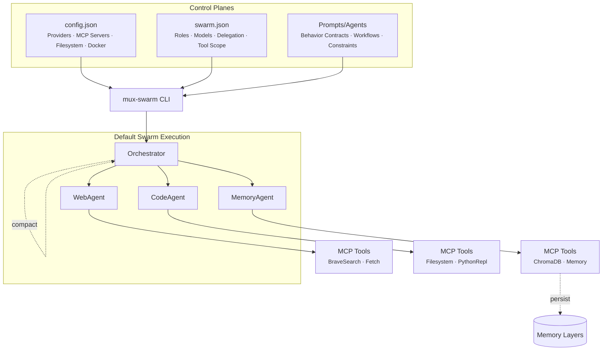

<a id="readme-top"></a>

<div align="center">



<h1>Mux-Swarm</h1>
<p>A CLI-native, cross-platform, multi-agent runtime for deterministic, tool-native AI operations.</p>

[](#)
[](#)
[](#)
[](#license)

<a href="#quick-start"><strong>Quick Start »</strong></a>
&nbsp;·&nbsp;
<a href="#usage">Usage</a>
&nbsp;·&nbsp;
<a href="#configuration">Configuration</a>
&nbsp;·&nbsp;
<a href="#architecture">Architecture</a>
&nbsp;·&nbsp;
<a href="#security--safety">Security</a>
&nbsp;·&nbsp;
<a href="#roadmap">Roadmap</a>

</div>

---

<!-- BANNER: Replace with a wide banner image (e.g. 1280x640).
     For dark/light variants, use <picture> as shown above for the logo. -->


<!-- DEMO: Replace with a terminal GIF or video.
     Recommended tools: VHS (github.com/charmbracelet/vhs), asciinema, or ttygif.
     For video, use the GitHub-native video embed:
<video src="https://github.com/<owner>/<repo>/assets/<id>/demo.mp4" controls width="100%"></video>
-->
<!--  -->

## Table of Contents

- [Quick Start](#quick-start)
- [About](#about)
- [Key Capabilities](#key-capabilities)
- [Usage](#usage) — [Interactive Commands](#interactive-commands) · [Goal-Driven Execution](#goal-driven-execution) · [Continuous Mode](#continuous-mode) · [CLI Flags](#cli-flags)
- [Configuration](#configuration) — [`config.json`](#configjson--infrastructure) · [`swarm.json`](#swarmjson--topology--roles) · [Prompts](#prompts-promptsagentsmd) · [Skills](#skills-skills)
- [Architecture](#architecture) — [Orchestration Lifecycle](#orchestration-lifecycle) · [Memory Architecture](#layered-memory-architecture)
- [Security & Safety](#security--safety)
- [Roadmap](#roadmap)
- [Contributing](#contributing)
- [License](#license)

---

## Quick Start

### Prerequisites

- An LLM provider API key (any [OpenAI-compatible](https://platform.openai.com/docs/api-reference) endpoint), set as an environment variable
- **Node / npm** (`npx`) for Node-based [MCP](https://modelcontextprotocol.io/) servers
- **uvx / uv** for Python-based MCP servers
- **Note Mux-Swarm utilizes the ChromaDB MCP server in its default config which has a known issue with python version 3.14** - Therefore it is recommended uv / uvx is configured to utilize a seperate python version eg. 3.12

### Install via Script (Recommended)

**Linux / macOS:**

```bash
curl -fsSL https://www.muxswarm.dev/install.sh | bash
```

**Windows (PowerShell):**

```powershell
irm https://www.muxswarm.dev/install.ps1 | iex
```

The installer downloads the latest release, installs the runtime locally, and adds `mux-swarm` to your PATH.

### Build From Source

Requires [Git](https://git-scm.com/) and [.NET SDK](https://dotnet.microsoft.com/download) compatible with net10.0.
```bash
git clone https://github.com/<owner>/mux-swarm.git
cd mux-swarm
dotnet build
```

**Run from source:**
```bash
dotnet run --project Mux-Swarm.csproj
```

### First Run

```bash
# Interactive
mux-swarm

# Single goal
mux-swarm --goal "Create a detailed report from the shareholder data in your sandbox and save it under an allowed path"

# Continuous autonomous loop
mux-swarm --continuous --goal "Monitor recent AI related news daily and keep a rolling report of public sentiment based on company in the sandbox" --goal-id web-loop --min-delay 43200
```

See [Usage](#usage) for the full command reference and [CLI Flags](#cli-flags) for all options.

---

## About

**mux-swarm** is a configurable agentic runtime that operates alongside your OS in user space — not as an agentic chat interface, but as a configurable execution environment for AI agents.

Out of the box it ships with a general-purpose swarm of specialized agents (research, coding, analysis, automation, system operations) coordinated through an orchestrator that delegates work, manages results, and executes multi-step objectives. The real versatility comes with the [**configuration-driven architecture**](#configuration): define custom swarms, agent roles, [prompts](#prompts-promptsagentsmd), MCP servers, [skills](#skills-skills), and execution policies entirely through config files. Swap providers, redesign agent topologies, or adapt the runtime for anything from personal workflows to enterprise pipelines — all without modifying code.

The runtime is **MCP-native** ([Model Context Protocol](https://modelcontextprotocol.io/)) for tool integration, supports any OpenAI-compatible LLM provider, and includes a modular **skills system** that lets agents load structured instructions dynamically at runtime. Together, MCP tools and skills form the operational surface of the swarm — keeping workflows transparent, auditable, and extensible.

<!-- ARCHITECTURE DIAGRAM: Replace with a Mermaid diagram, Excalidraw export, or SVG.
     A simple box flow showing: config.json → swarm.json → prompts → mux-swarm CLI → agents
     See the Architecture section below for the conceptual model. -->
<!--  -->

---

## Key Capabilities

**[Orchestration](#orchestration-lifecycle)** — Multi-agent coordination with explicit role boundaries, single-agent and swarm modes, config-driven model routing per role, and continuous autonomous execution with configurable loop timing.

**[Execution](#usage)** — CLI-native runtime for scripts and pipelines, sandboxed Docker execution, machine-readable `--stdio` mode, and filesystem allowlist enforcement with scoped tool access. Designed to embed cleanly into larger systems — from personal automation scripts to backend services and enterprise pipelines.

**[Extensibility](#configuration)** — MCP-native tool integration with strict-mode validation, modular [skills system](#skills-skills) for dynamic operational playbooks, any OpenAI-compatible LLM provider, and cross-platform support (Windows, Linux, macOS).

**[Safety](#security--safety)** — Least-privilege role design through per-agent MCP scoping, bounded retries and iteration limits, deterministic completion signaling via `signal_task_complete`, artifact-first workflows with session-based provenance, and environment-variable-based secret handling.

---

## Built With

[.NET 10](https://dotnet.microsoft.com/) · C# 14 · [Microsoft.Extensions.AI](https://learn.microsoft.com/en-us/dotnet/ai/ai-extensions) · [OpenAI .NET SDK](https://github.com/openai/openai-dotnet) · [Model Context Protocol](https://modelcontextprotocol.io/) · [Spectre.Console](https://spectreconsole.net/)

---

## Usage

### Interactive Commands

```
/multiagent     Launch multi-agent swarm loop
/agent          Launch single-agent loop
/stateless      Launch stateless single agent loop, ideal for one-off tasks (sessions not persisted as to not convolute stateful agent runs)
/model          View current model assignments
/setmodel       Change the single-agent model
/tools          List available tools
/memory         View the knowledge graph
/sessions       List all saved sessions with type and agent count
/dockerexec     Toggle Docker execution mode
/setup          Run initial setup
/reloadskills   Refresh skills directory for any mid process changes
/refresh        Perform a full Mux system refresh by refreshing config, re-initializing MCP servers and re-loading skills
/report         Generate full session audit reports, tool calls, delegations, artifacts, and outcomes
/report <id>    Audit a specific session by timestamp
/compact        Compact current agent session for token burn prevention
/clear          Clear terminal
/exit           Exit the runtime
/qm or /qc      Stop the current session
```

### Goal-Driven Execution

```bash
mux-swarm "<goal>"
mux-swarm <goal.txt>
mux-swarm --goal "<goal>"
mux-swarm --goal <goal.txt>
```

### Continuous Mode

```bash
mux-swarm --continuous --goal "<goal>" --goal-id my-run
mux-swarm --continuous --goal task.txt --goal-id overnight --min-delay 600
```

### CLI Flags

```
--goal <text|file>         Goal input (text or file path)
--continuous               Enable continuous autonomous mode
--goal-id <id>             Persistent goal/session identifier
--min-delay <secs>         Minimum delay between loops (default 300)
--persist-interval <secs>  Persist session state interval
--session-retention <n>    Retain last N session runs (default 10)
--stdio                    Machine-readable output (no ANSI)
--watchdog [true|false]    Enable watchdog monitoring
--mcp-strict [true|false]  Require all integrations to connect
--docker-exec [true|false] Route execution through Docker
--model <id>               Override the single-agent model
--report [session-id]       Generate audit report(s) and exit, if no session id is passed reports for all saved sessions are generated
--clear                    Clear terminal before continuing
--help, -h                 Show help
```

---

## Configuration

mux-swarm separates configuration into two files:

- [**`Configs/config.json`**](#configjson--infrastructure) — Infrastructure & runtime environment (providers, MCP servers, filesystem boundaries, Docker posture)
- [**`Configs/swarm.json`**](#swarmjson--topology--roles) — Swarm topology & agent behavior (roles, model routing, delegation permissions, tool scope)

This separation lets you swap providers without redesigning the swarm, or redesign the swarm without changing infrastructure wiring.

### `config.json` — Infrastructure

Defines which external integrations are available, where the runtime can read/write, and which provider endpoint to use.

```json
{
  "mcpServers": {
    "Filesystem": {
      "type": "stdio",
      "command": "npx",
      "args": ["-y", "@modelcontextprotocol/server-filesystem"],
      "enabled": true
    },
    "Memory": {
      "type": "stdio",
      "command": "npx",
      "args": ["-y", "@modelcontextprotocol/server-memory"],
      "env": { "MEMORY_FILE_PATH": "/path/to/sandbox/memory.jsonl" },
      "enabled": true
    }
  },
  "llmProviders": {
    "openAiCompatible": {
      "enabled": true,
      "apiKeyEnvVar": "OPENROUTER_API_KEY",
      "endpoint": "https://openrouter.ai/api/v1"
    }
  },
  "filesystem": {
    "allowedPaths": ["/path/to/project"],
    "sandboxPath": "/path/to/project"
  }
}
```

### `swarm.json` — Topology & Roles

Defines which agents exist, what they specialize in, which models and MCP servers each role can access, and who can delegate.

```json
{
  "orchestrator": {
    "promptPath": "Prompts/Agents/orchestrator.md",
    "model": "google/gemini-3.1-pro-preview",
    "toolPatterns": ["Filesystem_list_directory", "Filesystem_read_file"]
  },
  "agents": [
    {
      "name": "WebAgent",
      "description": "Web browsing, research, and internet tasks.",
      "promptPath": "Prompts/Agents/web_agent.md",
      "model": "google/gemini-3.1-pro-preview",
      "mcpServers": ["BraveSearchMCP", "Fetch", "Filesystem"],
      "canDelegate": true
    },
    {
      "name": "CodeAgent",
      "description": "Code generation, editing, and debugging.",
      "promptPath": "Prompts/Agents/code_agent.md",
      "model": "openai/gpt-5.3-codex",
      "mcpServers": ["Filesystem", "BraveSearchMCP", "PythonReplMCP"],
      "canDelegate": true
    }
  ]
}
```

### Prompts: `Prompts/Agents/*.md`

Prompt files define the **behavioral contract** for each role — how an agent reasons, what it owns, which workflows it follows, and what constraints it respects. This is the main place to tune agent behavior without changing the runtime. See [Architecture](#architecture) for how prompts fit into the control plane model.

### Skills: `skills/*`

Skills are reusable operational modules agents discover and load at runtime via `list_skills` and `read_skill`. They keep core prompts lean while giving agents access to structured instructions when needed. Prompts define the **role**; skills provide the **task-specific playbooks**.

---

<a id="architecture"></a>

## Architecture

mux-swarm separates [configuration](#configuration) and execution into control planes and a runtime plane:

**Control Plane A — [`config.json`](#configjson--infrastructure)**: Infrastructure & runtime boundaries. Provider config, MCP integrations, filesystem access, Docker posture.

**Control Plane B — [`swarm.json`](#swarmjson--topology--roles)**: Swarm topology & capability routing. Agent roles, model routing, delegation permissions, tool scope.

**Control Plane C — [`Prompts/Agents`](#prompts-promptsagentsmd)**: Agent behavior contracts. Structured prompts defining reasoning, workflows, and interaction rules.

**Runtime — `mux-swarm` CLI**: Manages orchestration, agent sessions, delegation, tool invocation, loop controls, and goal execution lifecycle.



### Orchestration Lifecycle

When a goal is executed, the swarm follows a structured lifecycle:

1. **Analyze** the goal and determine strategy
2. **Delegate** to specialist agents by role and capability
3. **Execute** with bounded loop controls
4. **Evaluate and compact** results before orchestrator handoff
5. **Persist** durable knowledge through the [memory system](#layered-memory-architecture)
6. **Close** with explicit completion signaling (success, failure, or partial)

### Layered Memory Architecture

Instead of forcing every agent to carry large historical context, the runtime distributes knowledge across specialized memory layers with a dedicated Memory Agent managing retrieval and persistence.

**In-Context Working Memory** — Results from delegated agents are compressed and reinjected into orchestrator context, keeping token usage bounded during multi-step coordination.

**Semantic Memory (Vector Retrieval)** — A vector-based layer enables semantic search over prior knowledge, allowing agents to recall relevant context without loading full histories.

**Structured Knowledge Memory (Graph)** — A knowledge graph stores entities, relationships, and structured facts for deterministic queries where relationships matter over embedding similarity.

**Filesystem Artifact Layer** — Agents exchange artifacts, intermediate outputs, and analysis results through files — turning the filesystem into a lightweight message bus that mitigates hallucinations, reduces token burn, and prevents context drift.

---

## Security & Safety

mux-swarm is designed around scoped execution, explicit boundaries, and inspectable outputs.

**Core characteristics**: filesystem allowlist enforcement, least-privilege per-agent [MCP scoping](#swarmjson--topology--roles), prompt- and config-level role separation, deterministic completion signaling, session-based provenance and artifact trails, configurable Docker-based execution, and environment-variable-based secret handling.

### Recommended Production Stance

- Keep `--mcp-strict` enabled so startup fails if required integrations are unavailable
- Keep filesystem allowed paths minimal and purpose-specific
- Route execution-heavy tasks through Docker when possible
- Scope MCP servers and [tool patterns](#swarmjson--topology--roles) narrowly by role
- Use environment variables for all credentials
- Prefer file-path-based deliverables so outputs remain inspectable
- Use `/report` or `--report` to review session artifacts regularly

---

## Roadmap

**Near-term focus**: runtime reliability hardening for long-running workflows, expanded auditing and execution trace visibility, stronger isolation patterns, additional swarm configuration templates, and improved developer ergonomics around configuring and debugging swarms.

**Community**: community-contributed swarm templates, skill libraries, and reference configurations. Documentation improvements driven by real-world usage.

---

## Contributing

Contributions are welcome. Guidelines coming soon, open an issue to discuss.

---

## License

This project is licensed under the Apache License 2.0. See [LICENSE](LICENSE) for details.
