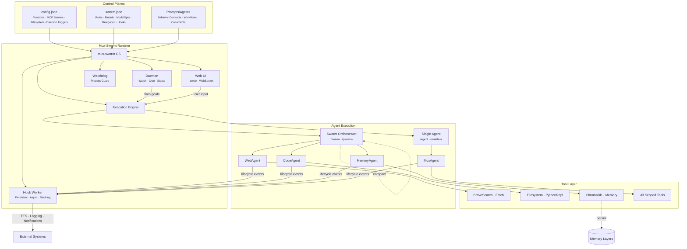

<a id="readme-top"></a>

<div align="center">


<h1>Mux-Swarm</h1>
<p>A CLI-native agentic OS for multi-agent orchestration, parallel execution, deterministic workflows, and tool-native AI operations. Process management, crash recovery, scoped isolation, layered memory, and a skills runtime. Define your config. Launch your swarm. The ceiling is yours.</p>

[](https://github.com/jnotsknab/mux-swarm/actions/workflows/ci.yml)
[](#)
[](#)
[](#license)

<a href="#quick-start"><strong>Quick Start »</strong></a>
&nbsp;·&nbsp;
<a href="#usage">Usage</a>
&nbsp;·&nbsp;
<a href="docs/examples.md">Examples</a>
&nbsp;·&nbsp;
<a href="#configuration">Configuration</a>
&nbsp;·&nbsp;
<a href="#architecture">Architecture</a>
&nbsp;·&nbsp;
<a href="#security--safety">Security</a>
&nbsp;·&nbsp;
<a href="#roadmap">Roadmap</a>

</div>

---


## Demo

[https://github.com/user-attachments/assets/3c40809c-93d9-4b8b-b090-736546a6461f](https://github.com/user-attachments/assets/3e817e6b-d339-4016-a386-23b9bfe4b72d)
> **See more in action:** Check out the [Examples & Demos](docs/examples.md) page for video walkthroughs of parallel swarm execution, autonomous runs, and real-world use cases.

## Case Study: Autonomous Model Specialization

A single goal file triggered an end-to-end autonomous pipeline including domain research, synthetic data generation via frontier model distillation, self-recovering training (4 consecutive failures fixed without human intervention), evaluation, and iterative self-improvement. Total cost: ~$11.

**[Read the full case study →](https://www.muxswarm.dev/case-study.html)**

## Table of Contents

- [Quick Start](#quick-start)
- [About](#about)
- [Key Capabilities](#key-capabilities)
- [Protocols & Standards](#protocols--standards)
- [Usage](#usage) — [Interactive Commands](#interactive-commands) · [Goal-Driven Execution](#goal-driven-execution) · [Continuous Mode](#continuous-mode) · [Parallel Mode](#parallel-mode) · [Workflow Engine](#workflow-engine) · [Event Hooks](#event-hooks) · [Web UI](#web-ui---serve) · [Daemon Mode](#daemon-mode---daemon) · [OS Service Registration](#os-service-registration---register----remove) · [CLI Flags](#cli-flags) · [Scoped Instances](#scoped-instances) · [User Identity](#user-identity-userinfo)
- [Configuration](#configuration) — [`config.json`](#configjson--infrastructure) · [`swarm.json`](#swarmjson--topology--roles) · [Model Tuning](#model-tuning-modelopts) · [Provider-Specific Parameters](#provider-specific-parameters-additionalparams) · [Execution Limits](#execution-limits-executionlimits) · [Prompts](#prompts-promptsagentsmd) · [Skills](#skills-skills)
- [Architecture](#architecture) — [Orchestration Lifecycle](#orchestration-lifecycle) · [Memory Architecture](#layered-memory-architecture)
- [Security & Safety](#security--safety)
- [Roadmap](#roadmap)
- [Contributing](#contributing)
- [License](#license)

---

## Quick Start

### Prerequisites

- An LLM provider API key (any [OpenAI-compatible](https://platform.openai.com/docs/api-reference) endpoint), preferably set as an environment variable
- **Node / npm** (`npx`) for Node-based [MCP](https://modelcontextprotocol.io/) servers
- **uvx / uv** for Python-based MCP servers

These are not hard requirements. During setup you can opt out of automatic installation, but you are responsible for ensuring that any MCP servers referenced in your `swarm.json` have their dependencies available on your system.

- **BRAVE_API_KEY** environment variable for the [Brave Search MCP](https://brave.com/search/api/) server, which is the default web search provider. Brave Search is recommended as it includes AI-generated summaries alongside results. It can be disabled in `swarm.json` and the swarm will fall back to the Fetch MCP server, though this is not recommended for optimal research quality.
- **Note: Mux-Swarm utilizes the ChromaDB MCP server in its default config which has a known issue with Python version 3.14.** It is recommended that uv / uvx is configured to utilize a separate Python version e.g. 3.12

### Install via Script (Recommended)

**Linux / macOS:**

```bash
curl -fsSL https://www.muxswarm.dev/install.sh | bash
```

**Windows (PowerShell):**

```powershell
irm https://www.muxswarm.dev/install.ps1 | iex
```

The installer downloads the latest release, installs the runtime locally, and adds `mux-swarm` to your PATH.

### Build From Source

Requires [Git](https://git-scm.com/) and [.NET SDK](https://dotnet.microsoft.com/download) compatible with net10.0.
```bash
git clone https://github.com/jnotsknab/mux-swarm.git
cd mux-swarm
dotnet build
```

**Run from source:**
```bash
dotnet run --project MuxSwarm.csproj
```

### First Run
> **New to Mux-Swarm?** See the [Setup Guide](docs/setup-guide.md) for a full walkthrough of first-time configuration with `/setup`, video examples, and tips for getting your first swarm running.
```bash
# Interactive
mux-swarm

# Single goal
mux-swarm --goal "Create a detailed report from the shareholder data in your sandbox and save it under an allowed path"

# Continuous autonomous loop
mux-swarm --continuous --goal "Monitor recent AI related news daily and keep a rolling report of public sentiment based on company in the sandbox" --goal-id web-loop --min-delay 43200

# Parallel batch dispatch
mux-swarm --parallel --goal "Research these five companies and produce individual summaries"
```

See [Usage](#usage) for the full command reference and [CLI Flags](#cli-flags) for all options.
---

## About

**mux-swarm** is a configurable agentic operating system that runs alongside your OS, not an agentic chat interface, but a configurable execution environment for AI agents with process management, crash recovery, multi-tenant isolation, layered memory, and a workflow engine.

Out of the box it ships with a general-purpose swarm of specialized agents (research, coding, analysis, automation, system operations) coordinated through an orchestrator that delegates work, manages results, and executes multi-step objectives. The real versatility comes with the [**configuration-driven architecture**](#configuration): define custom swarms, agent roles, [prompts](#prompts-promptsagentsmd), MCP servers, [skills](#skills-skills), and execution policies entirely through config files. Swap providers, redesign agent topologies, or adapt the runtime for anything from personal workflows to enterprise pipelines — all without modifying code.

The runtime is **MCP-native** ([Model Context Protocol](https://modelcontextprotocol.io/)) for tool integration, supports any OpenAI-compatible LLM provider, and includes a modular **skills system** that lets agents load structured instructions dynamically at runtime. Together, MCP tools and skills form the operational surface of the swarm — keeping workflows transparent, auditable, and extensible.

---

## Key Capabilities

**[Orchestration](#orchestration-lifecycle)** — Multi-agent coordination with explicit role boundaries, single-agent and swarm modes, parallel swarm execution for concurrent batch dispatch, config-driven model routing per role, and continuous autonomous execution with configurable loop timing.

**[Execution](#usage)** — CLI-native runtime for scripts and pipelines, scoped instance isolation via config overrides, sandboxed Docker execution, machine-readable `--stdio` mode, and filesystem allowlist enforcement with scoped tool access. Designed to embed cleanly into larger systems, from personal automation scripts to multi-user web applications and enterprise pipelines.

**[Extensibility](#configuration)** — MCP-native tool integration with strict-mode validation, modular [skills system](#skills-skills) for dynamic operational playbooks, any OpenAI-compatible LLM provider with multi-provider runtime swapping, per-agent [model tuning](#model-tuning-modelopts), and cross-platform support (Windows, Linux, macOS).

**[Safety](#security--safety)** — Least-privilege role design through per-agent MCP scoping, bounded retries and iteration limits, deterministic completion signaling via `signal_task_complete`, artifact-first workflows with session-based provenance, and environment-variable-based secret handling.

---

## Protocols & Standards

| Protocol | Description | Integration |
|----------|-------------|-------------|
| **[OpenAI Compatible API](https://platform.openai.com/docs/api-reference)** | Industry-standard chat completions and responses API. Any endpoint exposing `/v1/chat/completions` or `/v1/responses` works without code changes. | Multi-provider support with runtime swapping. Tested with OpenRouter, Ollama, LiteLLM, vLLM, LocalAI, and direct OpenAI/Google/xAI endpoints. |
| **[MCP (Model Context Protocol)](https://modelcontextprotocol.io/)** | Standardized protocol for AI agents to interact with external tools and services. Enables dynamic tool discovery and scoped execution. | Native dual-transport support (stdio + HTTP/SSE). Per-agent MCP server scoping via `swarm.json`. Strict-mode validation for production deployments. |
| **[Microsoft.Extensions.AI](https://learn.microsoft.com/en-us/dotnet/ai/ai-extensions)** | Unified .NET abstraction layer for AI services. Provider-agnostic `IChatClient` interface with streaming, tool invocation, and options propagation. | Core abstraction layer. All LLM interactions route through `IChatClient` with `ChatOptions` for per-agent model tuning. |
| **[Microsoft.Agents.AI](https://github.com/microsoft/Agents-for-net)** | Agent framework providing session management, chat history, streaming orchestration, and serializable session state. | Agent lifecycle management. Session serialize/restore for `/resume`. `ChatClientAgentOptions` for wiring model parameters and tools. |
| **[Agent Skills (SKILL.md)](https://docs.anthropic.com/en/docs/claude-code/skills)** | Markdown-based format for defining modular, reusable agent capabilities. Agents discover and load skills at runtime without code changes. | Built-in skills system with `list_skills` / `read_skill` tools. Per-agent skill scoping via `skillPatterns`. Hot-reload via `/reloadskills`. |
| **Session Serialization** | Full round-trip session state persistence via `SerializeSession` / `DeserializeSessionAsync`. Enables session portability and resume across restarts. | `/resume` command for single-agent session restore. Automatic session persistence with configurable intervals. |

---

## Built With

[.NET 10](https://dotnet.microsoft.com/) · C# 14 · [Microsoft.Extensions.AI](https://learn.microsoft.com/en-us/dotnet/ai/ai-extensions) · [Microsoft.Agents.AI](https://github.com/microsoft/Agents-for-net) · [OpenAI .NET SDK](https://github.com/openai/openai-dotnet) · [Model Context Protocol](https://modelcontextprotocol.io/) · [Spectre.Console](https://spectreconsole.net/)

---

## Usage

### Interactive Commands
```
/swarm          Launch multi-agent swarm loop
/pswarm         Launch parallel swarm loop and concurrent batch dispatch for independent tasks
/agent          Launch interactive single agent loop
/stateless      Stateless single agent loop, ideal for one-off tasks
/workflow       Run a deterministic workflow from a JSON file
/resume         Resume a previous single-agent session
/compact        Compact current session context (applies to single agent loops only)
/model          View current model assignments
/setmodel       Change the model for any agent, orchestrator, or compaction agent
/swap           Swap the active agent for single-agent mode
/provider       View or switch the active LLM provider
/limits         Display current execution limits for orchestration and agents
/tools          List available MCP tools across enabled servers
/skills         List available local skills
/memory         View the knowledge graph
/sessions       List all saved sessions with type and agent count
/status         View current system status: provider, models, tools, skills, and sessions
/dockerexec     Toggle Docker execution mode
/dbg            Enable tool call output (applies to stdio mode only)
/nodbg          Disable tool call output (applies to stdio mode only)
/setup          Run initial setup / reconfigure
/reloadskills   Refresh skills directory for any mid process changes
/refresh        Full Mux system refresh: config, MCP servers, and skills
/report         Generate full session audit reports
/report <id>    Audit a specific session by timestamp
/clear          Clear terminal
/exit           Exit the runtime
/qm or /qc      Stop the current session
```

### CLI Flags
```
--goal <text|file>         Goal input (text or file path)
--agent <name>             Run in single-agent mode with the specified agent
--provider <name>          Set the active LLM provider on launch (e.g. --provider ollama)
--continuous               Enable continuous autonomous mode
--goal-id <id>             Persistent goal/session identifier
--parallel                 Use parallel swarm (concurrent batch dispatch) instead of sequential
--max-parallelism <n>      Max concurrent agent tasks in parallel mode (default 4)
--min-delay <secs>         Minimum delay between loops (default 300)
--persist-interval <secs>  Persist session state interval
--session-retention <n>    Retain last N session runs (default 10)
--stdio                    Machine-readable output (no ANSI)
--serve [port]             Start embedded web UI (default 6723)
--daemon                   Start daemon mode (file watch, cron, status triggers)
--register                 Register mux-swarm as an OS service (survives reboots)
--remove                   Unregister mux-swarm OS service
--watchdog                 Enable external watchdog (auto-restart on crash)
--workflow <file>          Run a workflow file (JSON) on launch
--wf <file>                Alias for --workflow
--delimiter <str>          Set multi-line input delimiter (e.g. --delimiter ---)
--model <id>               Override the single-agent model
--mcp-strict [true|false]  Require all integrations to connect
--docker-exec [true|false] Route execution through Docker
--report [session-id]      Generate audit report(s) and exit
--cfg <path>               Override config.json path for scoped instances
--swarmcfg <path>          Override swarm.json path for scoped instances
--clear                    Clear terminal before continuing
--help, -h                 Show help
```

### Goal-Driven Execution
```bash
mux-swarm "<goal>"
mux-swarm <goal.txt>
mux-swarm --goal "<goal>"
mux-swarm --goal <goal.txt>
```

### Single-Agent via CLI
```bash
mux-swarm --agent CodeAgent --goal "<goal>"
mux-swarm --agent WebAgent --goal task.txt --continuous --goal-id overnight --min-delay 600
```

### Continuous Mode
```bash
mux-swarm --continuous --goal "<goal>" --goal-id my-run
mux-swarm --continuous --goal task.txt --goal-id overnight --min-delay 600
```

### Parallel Mode
```bash
mux-swarm --parallel --goal "<goal>"
mux-swarm --parallel --continuous --goal "<goal>" --goal-id batch-run
mux-swarm --parallel --max-parallelism 6 --goal task.txt
```

Parallel mode decomposes a goal into independent subtasks and dispatches them concurrently across agents. Use `--max-parallelism` to cap the number of simultaneous agent tasks (default 4). Combines with `--continuous` for recurring parallel batch runs.


### Workflow Engine

Define deterministic, replayable execution pipelines as JSON files. A workflow is a sequence of commands piped through the runtime, exactly as a human would type them, but reproducible and shareable.
```json
{
  "name": "Research and Report",
  "steps": [
    "/agent",
    "Search for the latest developments in quantum computing and summarize your findings",
    "/qc",
    "/swarm",
    "Take the research from the previous agent session and produce a formatted report",
    "/qm",
    "/pswarm",
    "Cross-reference the report against three independent sources for accuracy",
    "/qm"
  ]
}
```
```bash
# Run from CLI
mux-swarm --workflow ./workflows/research-pipeline.json

# Run mid-session
> /workflow ./workflows/research-pipeline.json
```

A single workflow file can transition between agent mode, swarm mode, and parallel swarm mode, chain REPL operations with persistent state, and orchestrate multi-step pipelines across different execution models. The runtime handles all state transitions, tool loading, and cleanup. When the workflow completes, control returns to the keyboard.

No DAG engine, no state machine, no YAML DSL. A workflow is a list of strings piped to the runtime. The architecture does the rest.

### Event Hooks

Hooks execute external commands in response to runtime lifecycle events. Configure them in `swarm.json` alongside your agent definitions. Each hook fires when its `when` clause matches an emitted event.
```json
{
  "hooks": [
    {
      "id": "notify-slack",
      "mode": "async",
      "command": "python scripts/notify.py",
      "when": { "event": "task_complete" }
    },
    {
      "id": "voice-out",
      "mode": "async",
      "persistent": true,
      "command": "python scripts/tts_voice.py",
      "when": { "event": "text_chunk" }
    },
    {
      "id": "log-tool-calls",
      "mode": "blocking",
      "command": "bash scripts/audit.sh",
      "timeoutSeconds": 10,
      "when": { "event": "tool_call", "agent": "CodeAgent" }
    }
  ]
}
```

Hooks receive the full event payload as JSON on stdin. Two dispatch modes: `async` fires and continues immediately, `blocking` waits for the process to exit (with configurable timeout). **Persistent hooks** (`"persistent": true`) start a long-lived process that receives events as NDJSON lines on stdin for the entire session, ideal for stateful consumers like TTS pipelines or live dashboards.

Pattern matching supports filtering by `event` type, `agent` name, and `tool` name. All fields in `when` except `event` are optional.

**Supported events (10):**

| Event | Description | Fires in |
|-------|-------------|----------|
| `session_start` | Mode entered (agent, stateless, swarm, pswarm) | All orchestrators |
| `session_end` | Session exited (complete, interrupted) | All orchestrators |
| `user_input` | Goal or message received | All orchestrators |
| `text_chunk` | Streaming token from agent response | All orchestrators |
| `turn_end` | Agent turn completed | All orchestrators |
| `agent_turn_start` | Agent begins a turn | All orchestrators |
| `tool_call` | Tool invocation | All orchestrators |
| `tool_result` | Tool execution result | All orchestrators |
| `task_complete` | Agent signals task done | All orchestrators |
| `delegation` | Orchestrator delegates to specialist | Multi + Parallel |

On startup, if hooks are configured, the runtime prompts for confirmation before enabling them. Hooks are suppressed in `--stdio` mode to avoid interfering with structured output.

### Web UI (`--serve`)

The `--serve` flag starts an embedded web interface alongside the normal agent runtime. MuxSwarm initializes as usual (config, providers, MCP servers, skills), then starts a Kestrel HTTP server that bridges the browser to the agent loop over a WebSocket.
```bash
mux-swarm --serve           # default port 6723
mux-swarm --serve 8080      # custom port
mux-swarm --serve --watchdog  # resilient always-on operation
```

The browser connects via WebSocket and receives the same NDJSON event stream that `--stdio` emits. User input flows back through the socket to the agent's input loop. No proxy, no subprocess, no second process. The web UI is a single `index.html` served from `Runtime/mux-web-app/`.

Features:
- Streaming agent responses with markdown rendering
- Tool call activity with friendly action descriptions
- Interactive prompts (select, confirm, input) rendered as clickable UI elements
- File browser sidebar for sandbox and session directories
- File upload via drag-drop, file picker, or clipboard paste (Ctrl+V)
- Cancel active agent turns via Stop button or Escape key
- Accessible on LAN and Tailscale (binds to all interfaces)
- Mobile responsive

The terminal continues to show the splash screen and MCP initialization progress while the browser receives only agent interaction events. Combine with `--watchdog` for process-level resilience where Kestrel restarts automatically on crash.

### Daemon Mode (`--daemon`)

The `--daemon` flag starts background trigger loops that fire goals into the runtime autonomously. Configure triggers in the `daemon` block of `config.json`. The daemon runs alongside the interactive loop and web UI, it does not block user interaction.
```bash
mux-swarm --serve --daemon              # web UI + daemon triggers
mux-swarm --serve --daemon --watchdog   # full always-on stack
```

Three trigger types:

**Watch** — monitors a file path pattern via `FileSystemWatcher`. Fires a goal when matching files are created or modified, with per-file cooldown debounce.

**Cron** — standard 5-field cron expressions (`minute hour day month weekday`). Supports `*`, `*/N`, `N-M`, and `N,M,O`. Sleeps until next occurrence.

**Status** — health checks that monitor resources without firing goals. Supports `http://` (HEAD request), `process:name` (process lookup), and `tcp:host:port` (connect check). Optionally restarts failed resources via registered handlers.
```json
{
  "daemon": {
    "enabled": true,
    "triggers": [
      {
        "id": "inbox-watcher",
        "type": "watch",
        "path": "/path/to/inbox/*.txt",
        "goal": "Read and process this file: {file}",
        "mode": "agent",
        "cooldown": 60
      },
      {
        "id": "daily-report",
        "type": "cron",
        "schedule": "0 9 * * 1-5",
        "goal": "Generate the daily status report and save to the sandbox",
        "mode": "swarm"
      },
      {
        "id": "serve-alive",
        "type": "status",
        "check": "http://localhost:6723",
        "restart": true,
        "interval": 30,
        "failThreshold": 3
      }
    ]
  }
}
```

Goal templates support `{file}`, `{filename}`, `{timestamp}`, and `{id}` substitution. Each trigger specifies a `mode` (`agent`, `swarm`, or `pswarm`) to control which orchestrator handles the goal. All triggers run as independent tasks — a slow swarm goal does not block status checks or other triggers.

Daemon emits hook events: `daemon_start`, `daemon_stop`, `daemon_trigger`, `daemon_status`.

### OS Service Registration (`--register` / `--remove`)

Register mux-swarm as a system service that starts automatically on boot. One command, no manual file editing.
```bash
# Register (run elevated on Windows)
mux-swarm --register --serve --daemon --watchdog

# Remove
mux-swarm --remove
```

The `--register` flag is stripped from the service definition — only runtime flags (`--serve`, `--daemon`, `--watchdog`) are forwarded. The binary path and working directory are resolved automatically from the install location (not from shell aliases).

| Platform | Mechanism | Details |
|----------|-----------|---------|
| **Windows** | Task Scheduler (XML) | Boot trigger with 30s delay, `RestartOnFailure` (60s interval, 999 retries), runs before user login, `WorkingDirectory` set |
| **Linux** | systemd user service | `Restart=always`, `RestartSec=10`, `enable-linger` for headless boot (starts before login) |
| **macOS** | launchd LaunchAgent | `RunAtLoad`, `KeepAlive`, logs to `~/.local/share/Mux-Swarm/Logs/` |

Combined with `--watchdog` (process-level restart) and daemon status triggers (subsystem-level restart), this creates a three-layer resilience stack: the OS ensures the process starts, the watchdog ensures it stays running, and the daemon ensures internal subsystems are healthy.

### Scoped Instances

The `--cfg` and `--swarmcfg` flags allow fully isolated runtime instances from a single installation. Each instance resolves its own provider, MCP servers, filesystem boundaries, storage paths, and user identity from its config files.
```bash
# User-scoped instances
mux-swarm --cfg /path/to/alice/Config.json --swarmcfg /path/to/alice/Swarm.json
mux-swarm --cfg /path/to/bob/Config.json --swarmcfg /path/to/bob/Swarm.json

# Environment-scoped instances
mux-swarm --cfg /etc/mux/production/Config.json --swarmcfg /etc/mux/production/Swarm.json

```

This enables multi-user deployments, per-environment configurations, and integration into larger systems where each consumer needs an isolated agent runtime.

### User Identity (`userInfo`)

An optional `userInfo` block in `config.json` injects user context into every agent's preamble. Agents receive the user's name, role, and any freeform context — adapting behavior without prompt changes.

All fields except `name` are optional. The `info` field is freeform and can carry preferences, domain context, or behavioral directives (e.g. `"Strict compliance mode. All outputs must reference internal policy docs."`).

---

## Configuration

mux-swarm separates configuration into two files:

- [**`Configs/config.json`**](#configjson--infrastructure) — Infrastructure & runtime environment (providers, MCP servers, filesystem boundaries, Docker posture)
- [**`Configs/swarm.json`**](#swarmjson--topology--roles) — Swarm topology & agent behavior (roles, model routing, model tuning, delegation permissions, tool scope)

This separation lets you swap providers without redesigning the swarm, or redesign the swarm without changing infrastructure wiring.

### `config.json` — Infrastructure

Defines which external integrations are available, where the runtime can read/write, and which provider endpoints to use. Supports multiple providers with runtime swapping via `/provider` or `--provider`.

```json
{
  "mcpServers": {
    "Filesystem": {
      "type": "stdio",
      "command": "npx",
      "args": ["-y", "@modelcontextprotocol/server-filesystem"],
      "enabled": true
    },
    "Memory": {
      "type": "stdio",
      "command": "npx",
      "args": ["-y", "@modelcontextprotocol/server-memory"],
      "env": { "MEMORY_FILE_PATH": "/path/to/sandbox/memory.jsonl" },
      "enabled": true
    }
  },
  "llmProviders": [
    {
      "name": "openrouter",
      "enabled": true,
      "apiKeyEnvVar": "OPENROUTER_API_KEY",
      "endpoint": "https://openrouter.ai/api/v1"
    },
    {
      "name": "ollama",
      "enabled": true,
      "endpoint": "http://localhost:11434/v1"
    }
  ],
  "filesystem": {
    "allowedPaths": ["/path/to/project"],
    "sandboxPath": "/path/to/project",
    "chromaDbPath": "/path/to/project/chroma-db",
    "knowledgeGraphPath": "/path/to/project/memory.jsonl"
  },
  "userInfo": {
    "name": "Micky",
    "role": "admin",
    "timezone": "America/New_York",
    "locale": "en-US",
    "info": "Prefers concise responses. Primary stack is .NET/C#."
  }
}
```
> **Enterprise Storage:** `allowedPaths` works with any storage that presents as a filesystem path — Azure Blob Storage ([BlobFuse](https://github.com/Azure/azure-storage-fuse)), AWS S3 ([Mountpoint](https://github.com/awslabs/mountpoint-s3), [s3fs](https://github.com/s3fs-fuse/s3fs-fuse)), Google Cloud Storage ([GCS FUSE](https://cloud.google.com/storage/docs/cloud-storage-fuse/overview)), SMB/CIFS shares, and NFS mounts. Mount your cloud or network storage, add the mount path to `allowedPaths`, and agents read/write to it like any local directory. No code changes required.


### `swarm.json` — Topology & Roles

Defines which agents exist, what they specialize in, which models and MCP servers each role can access, who can delegate, and optional per-agent model tuning via [`modelOpts`](#model-tuning-modelopts).

```json
{ 
  "executionLimits": {
    "progressEntryBudget": 1000,
    "crossAgentContextBudget": 2000,
    "progressLogTotalBudget": 4500,
    "maxOrchestratorIterations": 15,
    "maxSubAgentIterations": 8,
    "maxSubTaskRetries": 4,
    "maxStuckCount": 3
  },
  "compactionAgent": {
    "model": "google/gemini-3-flash-preview",
    "autoCompactTokenThreshold": 80000,
    "modelOpts": {
      "temperature": 0.2,
      "topP": 0.85,
      "maxOutputTokens": 4096
    }
  },
  "singleAgent": {
    "name": "MuxAgent",
    "promptPath": "Prompts/Agents/chat_prompt.md",
    "model": "google/gemini-3.1-pro-preview",
    "modelOpts": {
      "temperature": 0.6,
      "topP": 0.95,
      "maxOutputTokens": 16384
    },
    "mcpServers": ["Filesystem", "Memory", "BraveSearchMCP"],
    "toolPatterns": []
  },
  "orchestrator": {
    "promptPath": "Prompts/Agents/orchestrator.md",
    "model": "google/gemini-3.1-pro-preview",
    "modelOpts": {
      "temperature": 0.3,
      "topP": 0.9,
      "maxOutputTokens": 4096
    },
    "toolPatterns": ["Filesystem_list_directory", "Filesystem_read_file"]
  },
  "agents": [
    {
      "name": "WebAgent",
      "description": "Web browsing, research, and internet tasks.",
      "promptPath": "Prompts/Agents/web_agent.md",
      "model": "google/gemini-3.1-pro-preview",
      "mcpServers": ["BraveSearchMCP", "Fetch", "Filesystem"],
      "canDelegate": true
    },
    {
      "name": "CodeAgent",
      "description": "Code generation, editing, and debugging.",
      "promptPath": "Prompts/Agents/code_agent.md",
      "model": "google/gemini-3.1-pro-preview",
      "modelOpts": {
        "temperature": 0.4,
        "maxOutputTokens": 8192
      },
      "mcpServers": ["Filesystem", "BraveSearchMCP", "ReplShellMCP"],
      "canDelegate": true
    }
  ]
}
```

### Model Tuning (`modelOpts`)

Any agent, orchestrator, singleAgent, or compactionAgent supports an optional `modelOpts` block for per-agent model parameter tuning. All fields are optional — omitted values use provider defaults.

```json
"modelOpts": {
  "temperature": 0.7,
  "topP": 0.9,
  "topK": 40,
  "maxOutputTokens": 4096,
  "frequencyPenalty": 0.0,
  "presencePenalty": 0.0,
  "seed": 42
}
```

| Parameter | Type | Range | Description |
|-----------|------|-------|-------------|
| `temperature` | float | 0.0–2.0 | Controls output randomness. Lower = more deterministic, higher = more creative. |
| `topP` | float | 0.0–1.0 | Nucleus sampling — considers tokens within this cumulative probability mass. |
| `topK` | int | 1+ | Considers only the top K most probable tokens. Not all providers support this. |
| `maxOutputTokens` | int | 1+ | Hard ceiling on response length. |
| `frequencyPenalty` | float | -2.0–2.0 | Penalizes tokens proportionally to how often they appear. Reduces repetition. |
| `presencePenalty` | float | -2.0–2.0 | Penalizes any token that has appeared at all. Encourages topic diversity. |
| `seed` | long | — | Attempts deterministic output for identical inputs. Provider support varies. |

**Tuning guidelines:**
- **Orchestrators:** Low temperature (0.2–0.4) for consistent planning and delegation decisions.
- **Code agents:** Moderate temperature (0.3–0.5) for accurate but flexible code generation.
- **Research/general agents:** Higher temperature (0.5–0.7) for varied, comprehensive responses.
- **Compaction agents:** Low temperature (0.1–0.3) for faithful summarization.

#### Provider-Specific Parameters (`additionalParams`)

For parameters not covered by the standard `modelOpts` fields, use `additionalParams` to pass arbitrary key-value pairs directly to the provider via `ChatOptions.AdditionalProperties`. This is a pass-through, the runtime does not validate these values.
```json
"modelOpts": {
  "temperature": 0.3,
  "maxOutputTokens": 4096,
  "additionalParams": {
    "reasoning_effort": "high"
  }
}
```

Use the correct convention for your provider (e.g. `reasoning_effort` for OpenAI, `enable_thinking` for models that support it via OpenRouter).

### Execution Limits (`executionLimits`)

Optional tuning for orchestration budgets, iteration caps, and retry behavior. All fields are serialized with sensible defaults on first run. Adjust as needed. Raise limits for complex goals on capable models, lower for cost-sensitive deployments. Inspect active values at runtime with `/limits`.

| Parameter | Default | Description |
|-----------|---------|-------------|
| `progressEntryBudget` | 1000 | Max chars per compacted agent result returned to the orchestrator. |
| `crossAgentContextBudget` | 2000 | Max chars of prior agent context injected into a new sub-agent's task. |
| `progressLogTotalBudget` | 4500 | Max total chars of progress history sent in orchestrator continuation prompts. Oldest entries trimmed first. |
| `maxOrchestratorIterations` | 15 | Planning/delegation cycles before the orchestrator gives up. Overridden to unlimited in continuous mode. |
| `maxSubAgentIterations` | 8 | Tool-call loops per sub-agent delegation before forced completion. |
| `maxSubTaskRetries` | 4 | Retry attempts per failed sub-task with progressive recovery hints. |
| `maxStuckCount` | 3 | Consecutive empty responses before aborting. |
### Prompts: `Prompts/Agents/*.md`

Prompt files define the **behavioral contract** for each role — how an agent reasons, what it owns, which workflows it follows, and what constraints it respects. This is the main place to tune agent behavior without changing the runtime. See [Architecture](#architecture) for how prompts fit into the control plane model.

### Skills: `skills/*`

Skills are reusable operational modules agents discover and load at runtime via `list_skills` and `read_skill`. They keep core prompts lean while giving agents access to structured instructions when needed. Prompts define the **role**; skills provide the **task-specific playbooks**.

---

<a id="architecture"></a>

## Architecture

mux-swarm separates [configuration](#configuration) and execution into control planes and a runtime plane:

**Control Plane A — [`config.json`](#configjson--infrastructure)**: Infrastructure & runtime boundaries. Provider config, MCP integrations, filesystem access, Docker posture.

**Control Plane B — [`swarm.json`](#swarmjson--topology--roles)**: Swarm topology & capability routing. Agent roles, model routing, model tuning, delegation permissions, tool scope.

**Control Plane C — [`Prompts/Agents`](#prompts-promptsagentsmd)**: Agent behavior contracts. Structured prompts defining reasoning, workflows, and interaction rules.

**Runtime — `mux-swarm` CLI**: Manages orchestration, agent sessions, delegation, tool invocation, loop controls, and goal execution lifecycle.



### Orchestration Lifecycle

When a goal is executed, the swarm follows a structured lifecycle:

1. **Analyze** the goal and determine strategy
2. **Delegate** to specialist agents by role and capability
3. **Execute** with bounded loop controls
4. **Evaluate and compact** results before orchestrator handoff
5. **Persist** durable knowledge through the [memory system](#layered-memory-architecture)
6. **Close** with explicit completion signaling (success, failure, or partial)

### Layered Memory Architecture

Instead of forcing every agent to carry large historical context, the runtime distributes knowledge across specialized memory layers with a dedicated Memory Agent managing retrieval and persistence.

**In-Context Working Memory** — Results from delegated agents are compressed and reinjected into orchestrator context, keeping token usage bounded during multi-step coordination.

**Semantic Memory (Vector Retrieval)** — A vector-based layer enables semantic search over prior knowledge, allowing agents to recall relevant context without loading full histories.

**Structured Knowledge Memory (Graph)** — A knowledge graph stores entities, relationships, and structured facts for deterministic queries where relationships matter over embedding similarity.

**Filesystem Artifact Layer** — Agents exchange artifacts, intermediate outputs, and analysis results through files — turning the filesystem into a lightweight message bus that mitigates hallucinations, reduces token burn, and prevents context drift.

---

## Security & Safety

mux-swarm is designed around scoped execution, explicit boundaries, and inspectable outputs.

**Core characteristics**: filesystem allowlist enforcement, least-privilege per-agent [MCP scoping](#swarmjson--topology--roles), prompt- and config-level role separation, deterministic completion signaling, session-based provenance and artifact trails, configurable Docker-based execution, environment-variable-based secret handling, hook execution gating, and daemon trigger isolation.

### Recommended Production Stance

- Use `--cfg` and `--swarmcfg` to isolate per-user or per-environment instances
- Keep `--mcp-strict` enabled (enabled by default) so startup fails if required integrations are unavailable
- Keep filesystem allowed paths minimal and purpose-specific
- Route execution-heavy tasks through Docker when possible
- Scope MCP servers narrowly by role
- Use environment variables for all credentials
- Prefer file-path-based deliverables so outputs remain inspectable
- Use `/report` or `--report` to review session artifacts regularly
- Review hook commands before confirming on startup -- hooks run with your user permissions
- Scope daemon watch paths narrowly; avoid watching broad directories like home or root
- Use `--register` from an elevated terminal only when you've validated your daemon and hook config
- Pair `--daemon` with status checks (`failThreshold` > 1) to avoid restart loops on transient failures
- Use the three-layer resilience stack (`--register` + `--watchdog` + status triggers) for production always-on deployments rather than relying on any single layer
- For maximum isolation, run mux-swarm itself inside a Docker container with only the necessary volumes mounted -- this constrains all agent execution, hook commands, and daemon triggers to the container's filesystem and network boundaries regardless of configuration
---

## Roadmap

### Shipped

- **v0.8.0 — Daemon Mode & OS Service Registration**: Background trigger loops via `--daemon` with file watch (FileSystemWatcher + cooldown), cron (zero-dependency 5-field parser), and status checks (HTTP, process, TCP) with auto-restart. OS service registration via `--register`/`--remove` for Windows (Task Scheduler XML), Linux (systemd + linger), and macOS (launchd). Full hook lifecycle with 10 events across all orchestrators. `additionalParams` pass-through for provider-specific model options.
- **v0.7.0 — Event Hooks & Web UI**: Shell command execution triggered at lifecycle points via `swarm.json` hooks config. Async, blocking, and persistent dispatch modes with pattern matching on event type, agent, and tool. Embedded web UI via `--serve [port]` with Kestrel, WebSocket NDJSON bridge, file browser, upload/download, and mobile support. WebSocket-based cancellation via `StdinCancelMonitor.FireCancel()`.
- **v0.6.0 — Workflow Engine**: Declarative JSON workflow files for deterministic, replayable execution pipelines via `--workflow` and `/workflow`. Scripts the entire runtime across agent, swarm, and parallel swarm modes from a single file.
- **v0.6.0 — Token Tracking & Execution Limits**: Accurate provider-reported token tracking across all orchestration modes. Configurable `executionLimits` block in swarm.json for tuning orchestration budgets, iteration caps, and retry policies. `/limits` command for runtime inspection.
- **v0.5.0 — Parallel Swarm Execution**: Concurrent batch dispatch via `/pswarm` and `--parallel`. Decomposes goals into independent subtasks and executes them across agents simultaneously with configurable parallelism.
- **v0.5.0 — Stdin Cancellation (stdio mode)**: Out-of-band `__CANCEL__` signal for graceful turn cancellation in piped/stdio integrations.

### Up Next

#### v0.9.0 — OpenTelemetry Tracing
Native OTEL spans for agent turns, tool calls, and orchestrator iterations. Token metrics export for enterprise observability integration with Jaeger, Tempo, Datadog, or any OTLP-compatible backend.

### Community

Community-contributed swarm templates, skill libraries, and reference configurations. Documentation improvements driven by real-world usage.

---

## Contributing

Contributions are welcome. Please see [CONTRIBUTING.md](CONTRIBUTING.md) for guidelines, or open an issue to discuss.

---

## License

This project is licensed under the Apache License 2.0. See [LICENSE](LICENSE) for details.
