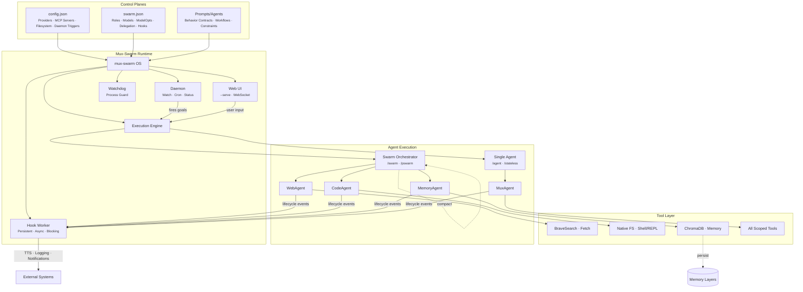

# Architecture

This page explains how mux-swarm fits together: the separation between configuration and
execution, the orchestration lifecycle a goal moves through, and the layered memory
architecture that keeps agent context bounded.

---

## Control Planes and the Runtime Plane

mux-swarm separates configuration and execution into control planes and a runtime plane:

**Control Plane A - `config.json`**: Infrastructure and runtime boundaries. Provider config,
MCP integrations, filesystem access, sandbox posture, daemon triggers.

**Control Plane B - `swarm.json`**: Swarm topology and capability routing. Agent roles, model
routing, model tuning, delegation permissions, tool scope, hooks, outbound webhooks.

**Control Plane C - `Prompts/Agents`**: Agent behavior contracts. Structured prompts defining
reasoning, workflows, and interaction rules.

**Runtime - `mux-swarm` CLI**: Manages orchestration, agent sessions, delegation, tool
invocation, loop controls, and goal execution lifecycle.

Why this split matters: the three control planes are declarative and diffable. Changing a
model assignment, a tool scope, or an agent's behavior contract never requires touching runtime
code, and the same runtime binary can host completely different swarms (see scoped instances in
the [Serve API reference](serve-api.md)).

---

## Orchestration Lifecycle

When a goal is executed, the swarm follows a structured lifecycle:

1. **Analyze** the goal and determine strategy
2. **Delegate** to specialist agents by role and capability
3. **Execute** with bounded loop controls
4. **Evaluate and compact** results before orchestrator handoff
5. **Persist** durable knowledge through the memory system
6. **Close** with explicit completion signaling (success, failure, or partial)

Bounded loop controls (iteration caps, retry limits, activity timeouts) are enforced at every
stage so a stuck specialist cannot wedge the whole swarm. Compaction between stages keeps the
orchestrator's working context small: specialists return summaries, not transcripts, and large
sub-agent outputs are spilled to disk and surfaced on demand rather than inlined.

---

## Layered Memory Architecture

Instead of forcing every agent to carry large historical context, the runtime distributes
knowledge across specialized memory layers with a dedicated Memory Agent managing retrieval and
persistence.

**In-Context Working Memory** - Results from delegated agents are compressed and reinjected
into orchestrator context, keeping token usage bounded during multi-step coordination.

**Semantic Memory (Vector Retrieval)** - A vector-based layer enables semantic search over
prior knowledge, allowing agents to recall relevant context without loading full histories.

**Structured Knowledge Memory (Graph)** - A knowledge graph stores entities, relationships,
and structured facts for deterministic queries where relationships matter over embedding
similarity.

**Filesystem Artifact Layer** - Agents exchange artifacts, intermediate outputs, and analysis
results through files - turning the filesystem into a lightweight message bus that mitigates
hallucinations, reduces token burn, and prevents context drift.

Each layer answers a different question: working memory answers "what just happened in this
run", the vector layer answers "what do we know that is similar to this", the graph answers
"how do these facts relate", and the filesystem answers "what physically exists". The
filesystem is always ground truth for artifacts: if memory and disk disagree about whether a
deliverable exists, disk wins.

---

## Key Invariants

A few properties hold across the whole runtime and are safe to build against:

- **Single shared event stream.** The NDJSON stream is the one wire format: `--stdio` writes it
  to stdout, `--serve` carries it over `/ws`, and bridges consume the same lines. There is no
  separate RPC surface per consumer.
- **Config resolves relative to the process.** `Configs/`, `Sessions/`, `Context/`, and
  `Runtime/` resolve off the executable's directory, which is what makes scoped instances
  (`--cfg` / `--swarmcfg`) and portable installs work.
- **The runtime itself does not authenticate by default.** Auth is opt-in (`serve.auth`) or
  delegated to a perimeter (reverse proxy). Write surfaces in serve mode are individually
  gated (`serve.editable`, `serve.configExposed`).
- **Background actors never get write tools.** Automatic subsystems that read session state
  (compaction, reflection gathering) operate read-only; anything that mutates memory or files
  flows through an agent turn the operator can observe.
- **Completion is explicit.** Every delegated task ends with a structured completion signal
  (success, failure, or partial), never an inferred silence.

---
[Back to docs index](README.md) | [Main README](../README.md)
